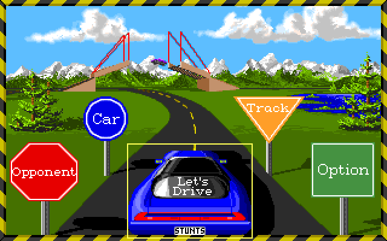
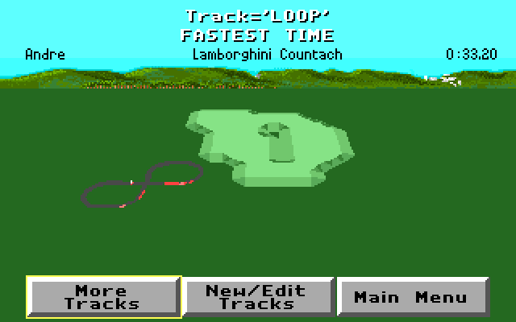

# Stunts AI driver
A Convolutional Neural Network (CNN) written in Python using Tensorflow that attempts to plays [1990's Stunts](https://en.wikipedia.org/wiki/Stunts_(video_game)).



I chose Stunts as my game environment because I can create custom tracks. The screen resolution is also small and simple which I think will help data analysis.

The game is available via [abandonware](http://www.abandonia.com/en/games/73/Stunts.html) and runs in [DOSBox](https://www.dosbox.com/).
## Status
I'm currently on getting 12%-15% accuracy so the car either does nothing (decides there's no input required) or only accelerates. This project is still a work-in-progress.

I made a custom, banked track that's a simple left-hand then right-hand loop.


## Recording training data
**NB** Recorder takes screenshots of the whole screen so you must play the game in fullscreen mode.
```Python
python recorder.py
```
Run the script then start the game, select a track and begin the race. Press F10 to start recording the screen and your inputs and F10 again to stop recording. Press F12 to stop the script running.

In a future update I want to cache the recording session so that if you crash you can discard the data without saving it to file.

## Training the model
```Python
python trainer.py
```

## Running the model
**NB** Runner takes screenshots of the whole screen so you must run the game in fullscreen mode.
```Python
python runner.py
```
Run the script then start the game, select a track and begin the race. Press F10 to allow the script to send keyboard commands and press F10 again to stop. Press F12 to stop the script running.